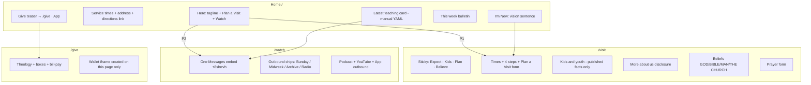
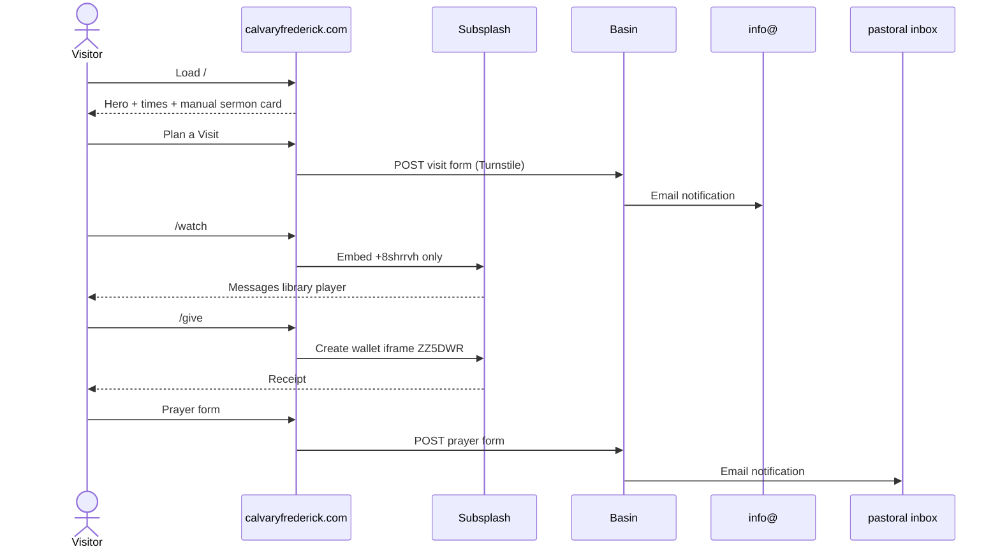

# Calvary Chapel Frederick — Website Rebrand Design

| Field | Value |
| --- | --- |
| **Document** | Implementation-ready design for a 2–3 page marketing site |
| **Customer** | Calvary Chapel Frederick |
| **Current site** | https://www.calvaryfrederick.com |
| **Author** | [Design / engineering lead] |
| **Date** | 16 August 2026 |
| **Status** | Draft (rev 4 — user decisions incorporated) |
| **Audience** | Implementing engineer + designer who have never been to Frederick, MD |
| **Companion** | [Subsplash stay vs leave](./subsplash-stay-vs-leave.md) — keep Wallet/Media/App; how to push this brand into that dashboard |

---

## Overview

Calvary Chapel Frederick is a single-campus Calvary Chapel church in downtown Frederick, Maryland. Their public identity is already clear and good: *“Simply Teaching The Word Simply.”* The problem is not theology or content volume — it is craft. The live marketing site is a **Squarespace 7.1** template (site ID `60ca8cb33fc0a801c490aaed`, identifier `cricket-tuba-jezb`, launched ~June 2021) with a 20-item foldered nav, empty `<meta name="description">`, leftover `/cart` commerce chrome, underline-outline buttons, and Raleway everywhere. **Giving, the sermon library, live/on-demand media, and the church app already live on Subsplash** (`+8361` / wallet embed `ZZ5DWR`). The brief assumed Subsplash *is* the website; the live HTML is explicitly `<!-- This is Squarespace. -->`. That distinction drives the whole architecture: **replace the marketing shell, keep Subsplash as the media/giving/app system of record.**

This document specifies a **three-page static site** that keeps the warmth and verse-by-verse Calvary identity the church already likes at [Koinonia Fellowship](https://koinoniafellowship.com), [Calvary Chapel of Delta](https://calvarydelta.com), and [Calvary Chapel Cincinnati](https://www.cccincinnati.org), and upgrades the craft using patterns (not feature-parity) from [Calvary Church NM / Albuquerque](https://calvarynm.church/) and [Harvest](https://harvest.org) / [harvest.church](https://harvest.church/). Scope stays at three marketing pages plus two thin utility routes (`/give`, `/privacy`) and a designed `/404`. Ministries, beliefs, prayer, the app, and events become **disclosed sections or outbound links**, not extra pages.

**DNS fact, verified 16 Aug 2026:** the zone is **not** on Cloudflare. Nameservers are `ns1.ipage.com` / `ns2.ipage.com`. Cutover is an iPage record change (or a deliberate zone migration), not CNAME flattening.

---

## Background & Motivation

### Who this church actually is (from the live site)

Facts below are taken from published pages. Do not invent staff, programs, or logistics the church has not published.

| Fact | Source |
| --- | --- |
| Legal / public name | **Calvary Chapel Frederick** |
| Tagline | **Simply Teaching The Word Simply** (homepage H1/H4 lockup) |
| Address | **244A S Jefferson St, Frederick, MD 21701** (homepage also writes “244A South Jefferson St.”) |
| Phone | **301-663-4485** |
| General email | **info@calvaryfrederick.com** |
| Ministry emails | youth@, women@, men@calvaryfrederick.com |
| Time zone | `America/New_York` (Squarespace context) |
| Sunday | **9:00 AM and 11:00 AM** |
| Midweek | **Wednesday 7:00 PM** (Bible study) |
| Children’s ministry | **Ship the `/im-new` reading (decided 16 Aug 2026).** Sunday: infants–5th grade. Wednesday children’s church: ages 3–11. Live `/children` still says infants–5th on both days — do **not** flatten to “kids at every service.” |
| Youth | Middle school **Sunday 9 AM**; Middle + High School **Wednesday 7 PM** (“Ignite” midweek discipleship study). High school attends the main Sunday service. |
| Pastor | **David Ochoa**. Wife **Michelle**. Live `/about-pastor-david` also names five children and a son-in-law — **omit family details on Visit** (decided 16 Aug 2026). |
| Pastor biography (public) | Came to faith at the **U.S. Naval Academy**, Annapolis; graduated **1991**; stationed San Diego; first encountered Calvary Chapel via radio and **Horizon Christian Fellowship**. Full-time ministry since **2002** as assistant pastor at **Cornerstone Chapel, Leesburg, VA** (four years). March **2006** weekly Bible study in Frederick; first service **November 2006**. |
| Geography they claim | “In the heart of Frederick between Baltimore and Washington, D.C.” |
| Mission | Matthew 28 Great Commission, quoted on `/mission-vision`: “Go therefore and make disciples of all nations…” |
| Vision (verbatim, also on `/im-new`) | “We at Calvary Chapel Frederick want to create a community where you will **encounter** the love *of* Jesus, be **equipped** for life *in* Jesus and **engage** a lost world *with* Jesus.” |
| Service shape (`/im-new`) | **Prayer → Worship → verse-by-verse Study → Fellowship** |
| Giving theology (`/giving`) | No plate is passed. Guided by **2 Corinthians 9:7** and **Matthew 6:3–4**. Offering boxes in the sanctuary; ACH/card via Subsplash; bill-pay/check to the church address to avoid fees. Published fees (re-verify at launch; Subsplash GrowCurve can change them): card **2.3% + $0.30**, ACH **1.0% + $0.30**. |
| Statement of faith | Live headings on `/statement-of-faith`: **GOD** (Father / Son / Holy Spirit), **BIBLE**, **MAN**, **THE CHURCH**. Body covers Spirit baptism as a subsequent/empowering work, all biblical gifts, pre-trib rapture, baptism by immersion, Communion, laying on of hands. They do not use the words “Trinity” or “inerrancy” as headings; they say “without error in the original manuscripts.” |
| Gospel presentation | Long pastoral letter on `/bestgift`, signed *Pastor David Ochoa*, using John 3:16 / Rom 3:23 / Rom 6:23 / Rom 5:8 / Eph 2:8–9. Published invitation language: feel welcome; bring a Bible if you have one, extras available. **Does not** say “Come as you are.” |
| Radio | **Truth with Grace** on Truth FM 97.1 (Cumberland, MD), The Word 99.7 FM (Finger Lakes, NY), Faith FM (Long Island, NY), Hope FM 97.5 (Baltimore). |
| Social | Instagram [@calvarychapelfrederick](https://www.instagram.com/calvarychapelfrederick/), Facebook [CalvaryChapelFrederick](https://www.facebook.com/CalvaryChapelFrederick) (live footer uses `http://facebook.com/…`; schema uses `https://`), YouTube [UCZG6R1UGPL4Eo07ghop7gJA](https://www.youtube.com/channel/UCZG6R1UGPL4Eo07ghop7gJA) |
| Current Sunday series (Subsplash, Aug 2026) | **Hebrews**, plus an **Easter 2026** collection |
| Care / hospitality (`/hospitality`) | Page title **“care Ministry.”** Assistance for those in need, especially within the body; call **301-663-4485**. Scripture 1 John 3:17–18. **Do not port** the stale overlay “All church services and activities are canceled on Sunday, January 25th, 2026 due to inclement weather.” |
| Prayer form (live) | Name, Email, How did you hear about us? (`I am a regular attender.` / `I watch online.` / `I listen to Truth With Grace Radio program.` / `Other`), Prayer Request. **No** confidential checkbox. `captchaEnabled: false`. |
| I'm New form (live) | Name, Email, Message only. |
| Serve volunteer options (verbatim from `/serve`) | Children’s Sunday School Teacher or Helper; Middle / High School Sunday School Teacher; Audio / Visual Support Volunteer; Cleaning Ministry Volunteer; Maintenance Team Volunteer; Greeting and Welcome Team Volunteer; Social Media or Photography Support Volunteer; Coffee Ministry Volunteer |
| `/vbs-2026` | **HTTP 404** as of 16 Aug 2026 (Squarespace 404 chrome titled “Calvary Chapel Frederick”). Not an empty program page. 301 to `/`. |
| `/contact` | **HTTP 404**. Real contact page is `/contact-us`. |

**Do not publish without church confirmation:** office hours (third-party listings disagree), parking instructions, clothing expectations, VBS dates, or any staff besides Pastor David. Coffee after service, kids age-ranges (`/im-new`), VOD-only Watch, hidden Israel 2027, and Git+YAML are **decided** (16 Aug 2026).

### Current technical reality

```
Marketing site  →  Squarespace 7.1  →  calvaryfrederick.com
DNS             →  iPage  ns1.ipage.com / ns2.ipage.com
www             →  CNAME ext-cust.squarespace.com
apex A          →  Squarespace  198.49.23.144/145, 198.185.159.144/145
MX              →  smtp.google.com  (Google mail works)
SPF             →  v=spf1 ip4:66.96.128.0/18 include:websitewelcome.com ?all
                   (iPage / websitewelcome — NOT Google’s SPF)
TXT             →  google-site-verification=F8Hk4Gix40QWAv3sb4bmytqN1k54BR_F5s-NpvYiIh4
                   google-gws-recovery-domain-verification=45656521
Giving          →  Subsplash Wallet iframe  https://wallet.subsplash.com/ui/embed/ZZ5DWR
Media library   →  https://subsplash.com/calvarychapelfrederick/media
                   org +8361
                   Messages library embed   +8shrrvh   (Sunday + Midweek + Archive)
                   Sunday collection        li/+gymzjvw
                   Midweek                  li/+w6wz2sw
                   Radio                    li/+hb4hczq
                   Archive (verse-by-verse) li/+bd45vsp
App             →  http://get.theapp.co/8361/
                   iOS 1224791391
                   Android com.subsplashconsulting.s_ZZ5DWR
Podcasts        →  Apple 212993025 (Sunday), 389963244 (Wednesday), 1378653159 (Truth with Grace)
Bulletins       →  /s/Bulletin-08-09-26-pdf.pdf and /s/Bulletin-08-16-26-pdf.pdf
                   302 → static1.squarespace.com/static/60ca8cb33fc0a801c490aaed/…/Bulletin+….pdf
Existing 301s   →  /connect → /im-new
                   /teachings → /watch-live
                   /new-folder-1 → /statement-of-faith
```

`/watch-live` is a Squarespace Embed block with no Subsplash ID in the static HTML (the embed is injected client-side). A Google-index snippet on 16 Aug 2026 showed “Sunday Service - Hebrews — Scheduled to broadcast 8/16/26 5:50am–7:50am,” which is a scheduler artifact, not a 5:50 AM church service. **v1 `/watch` is VOD-only** plus outbound YouTube and church-app links. No in-page live player (decided 16 Aug 2026).

### Pain points of the live site

1. **IA collapse failure.** Three folders — Teachings, Connect, About — hide 20 destinations. A first-time visitor who wants “when, where, kids, what happens” must hunt.
2. **Homepage is a bulletin board.** Skyline hero, then Last Week / This Week PDF buttons, then a tile wall (Watch Live, Teachings, Prayer, Truth with Grace, Israel 2027, App). No single primary CTA. Service times sit below the fold in all-caps Raleway.
3. **Generic 2010s church-template look.** Raleway 700/800, outline+underline buttons (`primary-button-style-outline primary-button-shape-underline`), white header / black type, rounded-10% gallery CSS, leftover cart.
4. **Homemade graphic tiles.** “Watch Live” is a snapshot of an open Bible, a red pen, a mug, and a laptop playing Pastor David — honest and warm, but typeset as a PNG with white overlay type. It reads as a Facebook cover, not a product surface.
5. **Empty SEO.** Homepage description is `""`. Open Graph image is the dove logo at 1500×1500, not a skyline or sanctuary frame. Schema is a bare `WebSite` + empty `LocalBusiness` (`openingHours: ""`).
6. **Stale and thin interior pages.** `/special-teachings-1` still leads with “March 12, 2019 — CCF Stay Retreat.” `/missions` is four unlabeled headshots (filenames `mcdaniels.jpg`, `boone.jpg`, `liveglobal.jpg`, `bahrona.jpg`) with no copy. `/hospitality` still carries a 25 Jan 2026 weather-cancellation overlay. `/vbs-2026` is a 404.
7. **Giving is theologically rich and visually poor.** Beautiful 2 Cor 9:7 / Matt 6:3–4 explanation, then a raw 630 px Subsplash iframe.
8. **No first-visit logistics.** Unlike Calvary Delta’s four-step “Grab a coffee → check in kids → find a seat → worship,” CCF’s `/im-new` is a wall of paragraphs plus a Name/Email/Message form. Parking, entrance, what to wear, how long the service lasts, and kids check-in are unpublished.

### What the church is responding to in the three reference sites

These are the sites they said they like. They feel dated. Keep the *spirit*; replace the *chrome*.

| Site | Spirit to keep | What feels dated |
| --- | --- | --- |
| [koinoniafellowship.com](https://koinoniafellowship.com) (WordPress) | Immediate “JOIN US” with times + address; “Plan a Visit” as the first verb; “line-by-line, book-by-book”; relaxed dress; greeters + parking lot attendants; bagels and coffee after service; “come, taste and see.” | WordPress stacked sections, ministry photo-grid with long blurbs, blog-style news, a “What We Believe” page that is an unsized theological treatise. |
| [calvarydelta.com](https://calvarydelta.com) | “Teaching the whole Bible, not just from it.” Numbered first-Sunday steps. Kids safety (background checks, pickup codes) stated plainly. Chuck Smith / CCA identity named without apology. Verse-by-verse as the product. | Competing card modules, two apps (Subsplash + Church Center) explained on the homepage, template typography, too many “Listen Now” siblings. |
| [cccincinnati.org](https://www.cccincinnati.org) | Service times as the first sentence. Latest sermons as **passage + date + teacher** (e.g. “Ezekiel 20:45–22:31 · Aug 9, 2026 · Pastor Brian Hill”). Gold/tan Calvary palette (`#edc482`, `#998b4e`). Explicit “know Jesus, follow Jesus, live for Jesus.” Link to Pastor Chuck’s teachings. | SnapPages template, Font Awesome icon soup, 12+ top-level ministry URLs (`/dv8-youth-group`, `/s-a-l-t-ministry`, `/woven`, `/walk-worthy`…), homepage that is times + events + three sermons and then stops. |

### What to borrow from the modern references (patterns only)

**[calvarynm.church](https://calvarynm.church/) did not redirect.** It is the live multi-campus site for Calvary Church Albuquerque (Skip Heitzig): Osuna, Westside, Santa Fe, East Mountains, Español. Do not copy campus-switcher IA or “Creating Life Change” brand language. Steal:

- One verb above the fold: **PLAN YOUR VISIT**
- Service times treated as a card, not a footer echo
- Plan-a-visit as a short form + “see you soon” confirmation, not a manifesto
- Restrained header; campus names are the only complexity (we have one campus — even simpler)
- In-person giving described as wooden boxes — CCF already has offering boxes; say so in the same quiet register

**Harvest is two properties.** [harvest.org](https://harvest.org) is a media/evangelism portal (Harvest+, crusades, store, Greg’s blog). [harvest.church](https://harvest.church) is the local-church site. **Do not build Harvest.org.** Steal from harvest.church / Riverside campus:

- Cinematic photography of *this* congregation, not stock raised hands
- “Plan Your Visit” repeated until it is unmissable
- Latest message as a single large object (title, teacher, play), not a six-tile media wall
- Kids / Youth as two sentences + a link, not mini-sites
- Nav restraint. Mega-church sitemap is the anti-pattern.

---

## Goals & Non-Goals

### Goals

1. A first-time Frederick resident can, in **under 15 seconds on a phone**, know: church name, that it is verse-by-verse Calvary Chapel, Sunday 9 & 11 / Wednesday 7, downtown address, kids are provided for, and how to plan a visit. **This contract is owned by Home and the above-the-fold of `/visit`, not by the whole Visit scroll.**
2. Visual craft that a 2026 designer would stand behind, without looking like a SaaS landing page.
3. Sermons remain one tap away via one on-page Subsplash embed plus collection deep links. Nothing in this project re-platforms media.
4. Giving remains Subsplash Wallet. Copy continues to honor their no-plate, cheerful-giver theology.
5. WCAG 2.2 AA. Many congregants are older; type, contrast, tap targets, and reduced-motion are not optional.
6. A volunteer with a GitHub login can change service times, the featured sermon title, the bulletin filename, and the men’s study line by editing **one YAML file** and replacing a PDF in `public/files/`. That path is documented in PR 1, not deferred to launch docs.
7. All current public URLs 301 to a sensible destination so Google, Facebook, and printed bulletins do not 404. `/s/*` is copied and redirected before DNS cut. There is **no** catch-all `/* → /`.

### Non-goals

- A 10–15 page ministry site (Women, Men, Youth, Children, Missions, Hospitality, Serve, Prayer, Contact, App, Podcasts, Truth with Grace, Best Gift, VBS, Israel 2027 as standalone pages).
- A fourth marketing page (`/about` or `/faith`) in v1. Beliefs stay on Visit, below a disclosure. A 4-page variant is costed under Alternatives, not the build.
- Feature-parity with Harvest (campuses, crusades, store, Harvest+, documentaries).
- Replacing Subsplash Giving, the church app, or the media archive.
- A custom sermon CMS, membership portal, Church Center, or events calendar product.
- Redesigning the dove mark into a trendy monogram.
- An in-page live player in v1.
- Live-chat, personalization, or A/B testing theater.
- On-origin form APIs (`src/pages/api/visit.ts` does not exist).
- Google Maps JavaScript embed / API key on `/visit`.

---

## Key Decisions

| # | Decision | Rationale |
| --- | --- | --- |
| K1 | **Three marketing pages, not two or four.** Home, Visit, Watch. Thin utilities: `/give`, `/privacy`, `/404`. | Home cannot hold cinematic hero + visit logistics + a Subsplash archive. Watch is justified by four real libraries. A fourth *marketing* page would unstick Visit packing but breaks the 2–3 page engagement; Visit is instead given a scroll budget and sticky subnav. |
| K2 | **Replace Squarespace. Keep Subsplash.** | Observed split: Squarespace = marketing, Subsplash = media/give/app. Rebuilding *inside* Subsplash would be a platform *change*. |
| K3 | **Astro 5 static on Cloudflare Pages. Volunteer source of truth is `src/data/church.yaml`.** Git at v1. No CMS. **Git + YAML decided 16 Aug 2026 — do not flip to Webflow.** | One YAML file for times, bulletin, featured sermon, men’s study, flags. TypeScript only *imports* that file. Volunteer edits in GitHub’s web editor and drops the new PDF in `public/files/`. |
| K4 | **Forest green + cream + brick + gold, proposed — not “sampled from the OG PNG.”** | Live OG/`dove+logo+inverted.png` is a **white/light-gray dove on transparent** (1500×1500). Live header is white bar / black type. Forest is a proposed primary grounded in Calvary-family dove-on-color treatments + the brick/cream of their Frederick skyline hero + Cincinnati gold `#edc482` they already responded to. Present as a proposal, not as a color drop from their file. |
| K5 | **Keep the dove. Refine the wordmark.** | The dove is Calvary Chapel family identity, the OG image, and the favicon. Inventing a new symbol would fail brand approval. Place the existing transparent dove on `--forest` in the new lockup. |
| K6 | **Primary CTA is “Plan a Visit.” Secondary is “Watch a Message.” Give is tertiary and quiet, on its own route.** | Matches Calvary NM / Harvest local-church pattern and their theology. `/giving` 301s to **`/give`**, not `/#give`. |
| K7 | **Watch IA option A: one Messages embed + outbound chips. Home sermon card is manual YAML.** | Embed only `+8shrrvh` (the Messages library: Sunday + Midweek + Archive). Chips open Sunday `+gymzjvw`, Midweek `+w6wz2sw`, Radio `+hb4hczq`, Archive `+bd45vsp` on Subsplash in a new tab. Do **not** build four in-page tabbed embeds. Do **not** fetch a live Subsplash thumbnail. |
| K8 | **Beliefs use their four live headings**, as an accordion *below* a “More about us” disclosure on Visit. | Live labels are GOD / BIBLE / MAN / THE CHURCH. Do not retitle MAN → Salvation or invent a “Hope” panel for the rapture paragraph. |
| K9 | **Events are a single “This week” card (bulletin PDF + 0–1 items), not a calendar product.** | They already publish weekly bulletin PDFs. Source of truth is `church.yaml` → `bulletin.file`. |
| K10 | **Type: Newsreader + Source Sans 3 only in v1.** | Two families, four files. Atkinson Hyperlegible is not loaded. Browser zoom + 17–18 px body covers older eyes; a large-type face can be a v1.1 flag. |
| K11 | **Host: Cloudflare Pages. Not Netlify.** | One host. Previews are `*.pages.dev` until the iPage `www` CNAME is pointed after PR 8. No `preview.calvaryfrederick.com` (that record does not exist and would require church DNS). |
| K12 | **Forms: Basin. Two endpoints only.** `visit` → office (`info@`). `prayer` → pastoral inbox (a second Basin form / mailbox, not the office group). | Ends the Formspark-or-Basin stall. Turnstile + honeypot ship **in the same PR as the forms**. No third “contact” form. No phone field (live I’m New has none; SMS consent is out of scope). |
| K13 | **Analytics: Cloudflare Web Analytics only.** No Plausible, no GA4, no Meta pixel. | Privacy-first, same vendor as hosting, no cookie banner for a church visit form. Revisit only if leadership explicitly asks. |
| K14 | **Kids copy uses the `/im-new` ranges.** Sunday infants–5th grade; Wednesday children’s church ages 3–11. Never “kids at every service.” | Decided 16 Aug 2026. Live `/children` conflicts; we do not flatten. |
| K15 | **Coffee after service is visitor-facing.** Visit step 4 includes a “stay for coffee” line. | Decided 16 Aug 2026. Not only a Serve volunteer role. |
| K16 | **Israel 2027 stays hidden.** `flags.israel2027: false`. No homepage teaser. | Decided 16 Aug 2026. Banner stays down until they later supply dates + URL. |
| K17 | **Visit pastor bio is the short ministry arc only.** Naval Academy → Horizon → Leesburg → 2006 Frederick. Omit “five children and a son-in-law.” | Decided 16 Aug 2026. |

---

## Proposed Design

### Brand & visual system

#### Color tokens

`--forest` is a **proposed** primary, not a sampled hex from `dove+logo+inverted.png`. Grounding: (a) typical Calvary dove-on-green lockups we will apply behind their transparent dove, (b) Frederick skyline hero (brick, cream sky, blue ridge), (c) Cincinnati gold/tan `#edc482` / `#998b4e`.

```css
:root {
  /* Core — proposed */
  --forest:        #3B5D46; /* proposed primary; approve in brand-lock meeting */
  --forest-deep:   #2A4333; /* header-on-photo, footer */
  --cream:         #F6F1E8; /* page ground, replaces #fff */
  --paper:         #FFFCF7; /* cards */
  --ink:           #1C1A17; /* body — not #000 */
  --ink-soft:      #5C574F; /* secondary text */

  /* Place */
  --brick:         #8E3D32; /* Frederick mill brick — used sparingly */
  --gold:          #C4A36A; /* Calvary-family gold */
  --gold-bright:   #EDC482; /* hover / scripture rule — from cccincinnati.org */

  /* System */
  --rule:          #E3D9C8;
  --focus:         #2A4333; /* 3px offset ring on cream */
  --live:          #B42318; /* reserved; unused in v1 (no live pip) */

  /* Semantic */
  --bg:            var(--cream);
  --bg-inverse:    var(--forest-deep);
  --text:          var(--ink);
  --text-inverse:  var(--cream);
  --action:        var(--forest);
  --action-hover:  var(--forest-deep);
}
```

**Usage rules**

- Primary buttons: `--forest` fill, `--cream` type. No underline-outline buttons.
- Secondary buttons: transparent, 1.5 px `--forest` stroke.
- Give / money: never brick, never live-red. Forest ghost button or text link.
- Scripture: Newsreader italic, `--forest-deep`, a 2 px `--gold` left rule.
- Gold type on cream is **not AA** (~2.1:1). Gold is decorative only.
- Cream on `--forest-deep` is ~9.6:1.
- Do not introduce teal, coral, electric purple, or near-black “startup navy.”

#### Typography

| Role | Face | Weights | Notes |
| --- | --- | --- | --- |
| Display / H1–H2 | **Newsreader** | **500 only** | Literary, Word-centered, not Inter. Fallback: `Iowan Old Style, Georgia`. Do not load 400 or 600 roman. |
| UI / nav / buttons / H3–H6 | **Source Sans 3** | **400, 600** | Humanist. `font-weight: 700` is **synthesized** from 600 — do not load a 700 file. |
| Body | **Source Sans 3** 400 / 17–18 px | — | v1 only. No third family. |
| Scripture | Newsreader **italic 400** | — | Never all-caps Raleway. Only italic file besides display 500. |
| Meta (times, labels) | Source Sans 3 600, 0.06 em tracking, sentence case | — | Kill the current `SUNDAY 9AM AND 11AM` shout. |

**Budget:** 2 families, **exactly 4 files** — Newsreader 500 roman, Newsreader 400 italic, Source Sans 3 400, Source Sans 3 600. `font-display: swap`. Preload Newsreader 500 woff2.

**Scale** (desktop / mobile)

| Token | Desktop | Mobile |
| --- | --- | --- |
| `--step-4` H1 | 64 / 68 | 36 / 40 |
| `--step-3` H2 | 40 / 46 | 28 / 34 |
| `--step-2` H3 | 28 / 34 | 22 / 28 |
| `--step-1` lead | 22 / 32 | 18 / 28 |
| `--step-0` body | 18 / 30 | 17 / 28 |
| `--step--1` meta | 14 / 20 | 13 / 20 |

Line length: 62–72 ch for prose. Headlines max 14 words.

#### Logo

- **Mark file:** existing Squarespace OG asset `dove+logo+inverted.png` — **white/light-gray dove on transparent**, 1500×1500. Not a green-field tile.
- **New lockup:** that dove composited on a `--forest` rounded square with an 8 px cream stroke. This lockup is new; approve in the brand-lock meeting.
- **Wordmark:** `Calvary Chapel` in Newsreader 500, `Frederick` in Source Sans 3 600, stacked, optical cap-height match to the dove.
- **Lockups:** (1) dove-on-forest + stacked wordmark for header, (2) dove only 40×40 for favicon / app badge, (3) cream dove on `--forest-deep` for inverse footer.
- **Clear space:** 0.5× dove height. Do not put the dove on photography without a 60% forest scrim.
- **Do not** redraw the dove as a line-art logomark or add a cross, mountain, or “CCF” monogram in v1.

#### Photography direction

Observed live assets to *keep using or reshoot in the same register*:

- Downtown Frederick golden-hour skyline (brick mill, steeples, Catoctin ridge) — current hero `Frederick_City_Skyline.jpeg`. Usable for v1 **if** the church confirms they own or licensed it (asset-collection step in PR 0).
- Pastor David teaching (appears inside the homemade Watch Live still).
- Open Bible on wood — honest, not stock.
- Congregation-in-place photos if the church will license them. Prefer sanctuary, lobby, kids rooms, Jefferson Street exterior.

**Direction for new shoots (half day, after photo release):**

1. Exterior of 244A S Jefferson at 8:40 AM Sunday (arrival light).
2. Lobby / welcome, kids check-in, sanctuary from the back third.
3. Worship (no fog-machine concert language), pulpit mid-teaching, fellowship after.
4. Close portraits of Pastor David and Michelle *only if they approve*.
5. Detail: open pew Bible, offering box, coffee, lyric screen.

Avoid: stock “diverse friends laughing with coffee,” lens flare, teal-orange grade, raised-hands silhouettes against stadium LEDs.

#### Iconography

Custom 1.5 px stroke set, 24 px optical, rounded caps. Eight icons only: pin, clock, child, book, headphones, heart (prayer), gift (give), play. No Font Awesome, no Typicons. Ships in PR 2 with the chrome.

#### Motion

- Global: `tweak-global-animations-animation-style-fade` is already their Squarespace setting. Keep that spirit.
- Enter: `opacity 0→1`, `translateY(8px→0)`, 400 ms `cubic-bezier(0.22, 1, 0.36, 1)`.
- No live-pip pulse in v1 (no live player).
- No spring, no hover-lift of 12 px, no marquee, no scroll-jacking.
- `prefers-reduced-motion: reduce` → opacity only, 1 ms transforms.
- Motion tokens live in `src/styles/motion.css` (PR 2).

#### Spacing, grid, breakpoints

- Fluid space scale: `--space-1` 4 → `--space-16` 96. Section padding `--space-16` desktop / `--space-10` (40) mobile.
- Grid: 12 col, max width **1200 px**, gutter 24, page margin 24 / 16.
- Breakpoints: `640` (sm), `768` (md), `1024` (lg), `1280` (xl). Mobile-first.
- Tap targets ≥ 44×44. Service-time card is a full-width stack under 768.
- All in-page targets (`#plan`, `#expect`, `#kids`, `#believe`, `#ministries`, `#gospel`, `#prayer`, `#care`, `#app`) get `scroll-margin-top: 96px` to clear the fixed header.

#### Component inventory

| Component | Behavior |
| --- | --- |
| `SiteHeader` | Cream bar, dove-on-forest + wordmark left. Desktop links: Visit · Watch · Give (`/give`). Right: solid button **Plan a Visit** → `/visit#plan`. On scroll-over-hero, bar becomes `forest-deep/80` + blur(12) + cream type. Hamburger is two-line (their current `doubleLineHamburger`), full-screen cream sheet, 22 px type. No cart. |
| `Hero` | 85–92 vh. Skyline (or new Jefferson St exterior) with 40% forest-deep gradient from bottom. H1: “Simply Teaching The Word Simply.” Sub: “A Calvary Chapel in downtown Frederick.” CTAs: Plan a Visit + Watch a Message. |
| `ServiceTimesCard` | Three rows: Sunday 9:00 & 11:00 AM · Wednesday 7:00 PM · **Kids: Sunday infants–5th grade; Wednesday children’s church ages 3–11** (do not say “at every service”). Address + **Get directions** as `<a href="https://www.google.com/maps/search/?api=1&query=244A+S+Jefferson+St,+Frederick,+MD+21701">` — **not** a Maps iframe. “Add to calendar” offers **three** `.ics` files: next Sunday 9 AM, next Sunday 11 AM, next Wednesday 7 PM. |
| `SermonCard` | 16:9 **static** image from `church.yaml` (`sermon.image`, default a local sanctuary/Bible still — never a live Subsplash fetch). Series kicker, title, “Pastor David Ochoa,” optional duration, link to `/watch`. Home shows **one**. All four fields are manual. |
| `VisitSteps` | Four numbered steps (Delta pattern, CCF facts): Arrive · Kids · The service · Stay after. Copy in Content Model. Parking sentence omitted until the church writes it. |
| `VisitSubnav` | Sticky in-page nav on `/visit` after the hero: **Expect · Kids · Plan · Believe**. Does not appear on Home. |
| `BeliefAccordion` | Four collapsed items using **live headings**: God · Bible · Man · The Church. Summaries quote/condense the live paragraphs; full text in `src/content/pages/faith.md` behind “Read the statement of faith.” |
| `GivePage` | Route `/give`. Short 2 Cor 9:7 / Matt 6:3–4 paragraph + three paths: Offering boxes / Bill-pay & check / iframe. Iframe is **created on first paint of this page only** (not on Home). Height `min(630px, 80vh)`. Plaintext fallback: “Open giving on Subsplash” → `https://wallet.subsplash.com/ui/embed/ZZ5DWR`. Re-verify fee numbers at launch against the live `/giving` page. |
| `BulletinCard` | “This week” + link to `church.yaml` `bulletin.file` (e.g. `/files/Bulletin-08-16-26-pdf.pdf` — **Squarespace slug byte-for-byte**, including the `-pdf` segment). Manual update. |
| `PlanVisitForm` | **Name, email, which service (Sun 9 / Sun 11 / Wed 7), kids ages (optional), notes.** No phone. Posts to Basin `visit` endpoint. Honeypot field `website` + Cloudflare Turnstile. Success: “We’ll look for you this Sunday. If you have questions before then, call 301-663-4485.” **Do not** ship a `[TBD with church]` parking clause. |
| `PrayerForm` | Live fields only: Name, Email, How did you hear about us? (verbatim options), Prayer Request. **No confidential checkbox unless pastors request it in the content workshop** (then it is marked new, not existing). Posts to Basin `prayer` endpoint (pastoral mailbox). Same Turnstile + honeypot. |
| `SiteFooter` | Four columns: Visit (times, address, phone, email), Watch, Connect (app `#` on Home / `/#app` from other pages, Instagram, Facebook, YouTube), Give → `/give`. Dove inverse. “Calvary Chapel Frederick · Simply Teaching The Word Simply.” |
| `NotFound` | Designed `/404`. Church name, one sentence, links to Home / Visit / Watch. **Never** redirect unknown paths to `/`. |

### Information architecture

#### Exact page list

```
/                 Home
/visit            I'm New + plan-a-visit (above the fold) + disclosed about/beliefs
/watch            VOD: one Messages embed + outbound collection chips
/give             Thin giving page (iframe + theology). Not a “4th marketing page.”
/privacy          Required for forms + analytics
/404              Designed
/files/*          Bulletins and any other migrated /s/ objects
```

#### Primary / secondary CTAs

| Priority | Label | Destination |
| --- | --- | --- |
| P1 | Plan a Visit | `/visit#plan` |
| P2 | Watch a Message | `/watch` |
| P3 | Get Directions | Google Maps **search URL** (new tab), not an embed |
| P4 | Give | `/give` → Subsplash `ZZ5DWR` |
| P5 | Download the App | `https://get.theapp.co/8361/` |

#### Hash-router and dialog contract

Fragments are not sent to the server. Every hash we advertise must work after a 301 lands on the destination HTML.

```
On DOMContentLoaded (and hashchange):
  /visit#plan        → scroll to #plan (form). scroll-margin-top 96px.
  /visit#expect      → #expect (steps)
  /visit#kids        → #kids
  /visit#believe     → opens the “More about us” <details> if closed, then #believe
  /visit#faith       → alias of #believe (old /statement-of-faith)
  /visit#gospel      → opens More about us, then #gospel
  /visit#prayer      → #prayer (prayer form, below the fold)
  /visit#ministries  → opens More about us, then #ministries
  /visit#care        → opens More about us, then #care (Care Ministry copy)
  /#app or /watch#app → scroll to #app (Home app strip is also on Watch footer)
  /give              → no hash needed; iframe is the page
```

Implementation: ~15 lines in `src/scripts/hash.ts`, imported from `Base.astro`. No client router library.

If we later add a Home give dialog (we will not in v1), it would need: `role="dialog"`, `aria-modal="true"`, focus trap, ESC, return-focus to the opener. v1 avoids that by using `/give`.

#### Homepage — section-by-section wire

1. **Header**
2. **Hero** — skyline, tagline, P1 + P2.
3. **Service strip** — `ServiceTimesCard` overlapping the hero by 48 px.
4. **I'm New band** — 2-sentence vision (encounter / equipped / engage) + link to `/visit`.
5. **Latest teaching** — one manual `SermonCard` + “Browse the archive → `/watch`” (this link exists only after the Watch PR lands).
6. **This week** — bulletin PDF only unless a *non-Israel* flagged gathering is supplied. `flags.israel2027: false` — **no Israel 2027 teaser.** If nothing else is flagged, omit any event card and keep the bulletin.
7. **Word & radio** — two quiet outbound links: Truth with Grace collection, Apple podcasts.
8. **Give teaser** — 80-word theology + text link to `/give`. **No iframe on Home.**
9. **App** — `#app` + store badges → `get.theapp.co/8361/`.
10. **Footer**.



#### Visit page — scroll budget (this is the packing contract)

`/visit` is one URL so `/im-new`, `/statement-of-faith`, and `/bestgift` have a home. It is **not** allowed to be the 20-page sitemap in a trenchcoat.

**Default above the fold (phone, first 15 seconds):**

1. Short hero using **their** `/bestgift` wording, unedited in sense: “Please feel welcome to join us any time — we would love to meet you. If you have a Bible you can bring it; if not, we have extras.”
2. `ServiceTimesCard`
3. `VisitSteps` (four steps; parking line omitted until supplied)
4. `PlanVisitForm` (`#plan`)

**Immediately below, still first-scroll on desktop:**

5. Kids & Youth (`#kids`) — Sunday infants–5th grade; Wednesday children’s church ages 3–11; Middle school Sunday 9 AM in the youth room; High school in the main Sunday service; Midweek Ignite (MS + HS) Wednesday 7 PM. Do not say “at every service.”

**Sticky subnav** appears after the hero: Expect · Kids · Plan · Believe.

**Behind `<details id="more">` labeled “More about us”** (closed on load, auto-opened by `#believe` / `#faith` / `#gospel` / `#ministries` / `#care`):

6. Church story (≤120 words) + **short** Pastor David bio (≤120 words): Naval Academy → Horizon → Leesburg → 2006 Frederick. **Omit** five children / son-in-law. Sourced from `/about-pastor-david` and `/mission-vision`.
7. Beliefs accordion (`#believe`) — four live headings.
8. Ministries at a glance (`#ministries`) — six text rows + published emails. Care Ministry (`#care`) uses the 1 John 3:17–18 / call-the-office copy from `/hospitality`, **without** the January 2026 weather banner.
9. “The Best Gift” (`#gospel`) — 150-word condensation + `<details>` with the existing `/bestgift` letter, unedited.

**Below the disclosure, still on `/visit`:**

10. Prayer form (`#prayer`).
11. Phone + email. **No Maps embed.**

Serve volunteer options are a `<details>` under the Serve row, labels **verbatim** from `/serve`. They post nowhere in v1 — “email info@ or call” — unless the content workshop asks for a serve form (then it is a third Basin endpoint, not in v1).

#### Watch page wire

v1 is **VOD only**.

- Page title “Watch.” No “Sunday service in progress” state.
- One `SubsplashEmbed` for the Messages library: `subsplashEmbed("+8361/lb/li/+8shrrvh?embed&branding", "https://subsplash.com/", "subsplash-embed-8shrrvh")`.
- Outbound chips (new tab), not tabs, not extra embeds:
  - Sunday → `https://subsplash.com/+8361/media/li/+gymzjvw`
  - Midweek → `https://subsplash.com/+8361/media/li/+w6wz2sw`
  - Archive → `https://subsplash.com/+8361/media/li/+bd45vsp`
  - Radio → `https://subsplash.com/+8361/media/li/+hb4hczq`
- Line: “Watch with us live on [YouTube](https://www.youtube.com/channel/UCZG6R1UGPL4Eo07ghop7gJA) or in the [church app](https://get.theapp.co/8361/).”
- Podcast badges (three Apple IDs).
- Embed script loads **only on `/watch`**. 16:9 reserved height.
- **No in-page live player, no `live.url` window, no Sunday-morning flag.** YouTube + app is enough (decided 16 Aug 2026).



#### What happens to current Squarespace URLs

Implement as `public/_redirects`. **No `/* / 302` catch-all.**

| Current | Destination | Notes |
| --- | --- | --- |
| `/im-new`, `/learn-more`, `/contact-us`, `/about-pastor-david`, `/mission-vision` | `/visit` | |
| `/contact` | `/visit` | Already 404; harmless 301 |
| `/connect` | `/visit` | Live already 302 → `/im-new` |
| `/new-folder-1` | `/visit#believe` | Live already 302 → `/statement-of-faith` |
| `/statement-of-faith` | `/visit#faith` | Client hash contract opens “More about us” |
| `/bestgift` | `/visit#gospel` | |
| `/prayer` | `/visit#prayer` | |
| `/women`, `/men`, `/youth`, `/children`, `/serve`, `/missions` | `/visit#ministries` | |
| `/hospitality` | `/visit#care` | Port Care copy only; **drop** 25 Jan 2026 banner |
| `/watch-live`, `/current-messages`, `/verse-by-verse`, `/special-teachings-1`, `/podcasts`, `/truth-with-grace` | `/watch` | |
| `/teachings` | `/watch` | Live already 302 → `/watch-live` |
| `/giving` | `/give` | Real route, not a homepage hash |
| `/church-app` | `/#app` | Home `#app` has scroll-margin; hash contract required |
| `/cart` | `/` | |
| `/vbs-2026` | `/` | Live **404**; keep 301 in case of old shares |
| `/s/*` | `/files/:splat` | See bulletin migration. **Required before DNS cut.** |

Folder prefixes that should 301 even with extra path segments (not a sitewide catch-all):

```
/teachings/*   /watch   301
/connect/*     /visit   301
```

Designed `/404` for everything else. Log 404s in Cloudflare for 14 days after cutover and add missing rules surgically.

---

### Content model

#### Volunteer-editable file (single source)

`src/data/church.yaml` is the only file a volunteer is taught to edit. `src/data/church.ts` is a typed import (`import data from './church.yaml'`). Long pastoral prose stays in Markdown and is not weekly-ops.

```yaml
# src/data/church.yaml  — volunteer-editable
name: Calvary Chapel Frederick
tagline: Simply Teaching The Word Simply
vision: >-
  A community where you will encounter the love of Jesus,
  be equipped for life in Jesus, and engage a lost world with Jesus.

address:
  line: 244A S Jefferson St
  city: Frederick
  region: MD
  postal: "21701"
  mapsQuery: "244A S Jefferson St, Frederick, MD 21701"

phone: "+1-301-663-4485"
email: info@calvaryfrederick.com
emails:
  youth: youth@calvaryfrederick.com
  women: women@calvaryfrederick.com
  men: men@calvaryfrederick.com

services:
  sunday: ["09:00", "11:00"]
  wednesday: "19:00"
  kidsSunday: Infants through 5th grade
  kidsWednesday: Children's church ages 3–11
  # Do not flatten to "kids at every service" (K14; /im-new reading)

youth:
  sunday: Middle school at 9:00, youth room
  wednesday: Middle and High School, 19:00, Ignite
  highSchoolSunday: Attends main service

pastor:
  name: David Ochoa
  spouse: Michelle
  visitBio: short-arc   # Naval Academy → Horizon → Leesburg → 2006; omit children

bulletin:
  file: /files/Bulletin-08-16-26-pdf.pdf   # keep Squarespace slug byte-for-byte
  label: This week

sermon:
  series: Hebrews
  title: ""                 # volunteer pastes latest title; empty → “Latest Sunday message”
  speaker: Pastor David Ochoa
  image: /images/sermon-fallback.jpg
  href: /watch

men:
  asOf: 2026-08
  blurb: >-
    2nd and 4th Thursday of the month at either 10am or 7pm,
    inductive study on the Gospel of Mark.

giving:
  platePassed: false
  boxes: Sanctuary offering boxes
  subsplashEmbed: https://wallet.subsplash.com/ui/embed/ZZ5DWR
  fees:
    card: 2.3% + $0.30      # re-verify at launch
    ach: 1.0% + $0.30
    verifiedOn: 2026-08-16

media:
  org: "+8361"
  messagesEmbed: "+8361/lb/li/+8shrrvh?embed&branding"
  sunday: "+gymzjvw"
  midweek: "+w6wz2sw"
  radio: "+hb4hczq"
  archive: "+bd45vsp"
  app: https://get.theapp.co/8361/
  youtube: https://www.youtube.com/channel/UCZG6R1UGPL4Eo07ghop7gJA

podcasts:
  sunday: "212993025"
  wednesday: "389963244"
  radio: "1378653159"

flags:
  israel2027: false     # decided 16 Aug 2026 — no homepage teaser
  vbs2026: false
```

#### Visit steps (draft — church must approve wording, not facts)

1. **Arrive.** 244A S Jefferson St, downtown Frederick. Come a few minutes early. *(No parking sentence until the church writes one.)*
2. **Kids.** Sunday: infants through 5th grade. Wednesday: children’s church ages 3–11. Age-appropriate Bible teaching, crafts, and games. Middle school meets Sunday at 9 in the youth room. High school joins the main service.
3. **The service.** Prayer and worship, then the Word taught verse by verse, chapter by chapter. Stay after for fellowship.
4. **Stay after.** Stay for coffee and fellowship. “They just love being together” (pastor’s published line). Introduce yourself to a greeter or to Pastor David and Michelle.

Duration is **not published**. Do not write “75 minutes” (Calvary Delta’s number).

#### Copy tone

- Pastoral, first-person plural, Scripture-literate, unhurried.
- Short sentences. No marketing exclamation.
- Prefer their words: *verse by verse*, *the Word*, *fellowship*, *cheerful giver*, *encounter / equipped / engage*.
- Dress: unpublished. Koinonia’s “don’t feel you have to get dressed up” may be drafted; they must approve. Do not attribute it to `/bestgift`.
- Gospel pages stay in Pastor David’s voice (`/bestgift`). Do not rewrite his invitation into brand-deck English.

#### What the church must supply vs what we can draft

| Must come from the church | We may draft for approval |
| --- | --- |
| Parking / entrance / accessibility | Homepage H1 subline |
| Service length | Four visit steps (minus parking; coffee line is approved) |
| Kids check-in procedure, if any | Short pastor bio (arc only; no family details) |
| Confirmation they own `Frederick_City_Skyline.jpeg` | Meta descriptions, OG titles |
| Mission partner names for the four headshots | Belief accordion summaries **using their four headings** |
| Latest bulletin PDF each week | Ministry one-liners (from live ministry pages) |
| Photo release for any new congregation images | Form success message (no TBD parking) |
| Pastoral inbox address for Basin prayer form | Redirect list; dove-on-forest lockup |

---

## API / Interface Changes

There is no application API and none will be added in v1.

```ts
// src/data/church.ts — typed import only
import spec from './church.yaml';
export const church = spec;

// Forms: browser POST to Basin endpoints in env
//   PUBLIC_BASIN_VISIT
//   PUBLIC_BASIN_PRAYER
//   PUBLIC_TURNSTILE_SITE_KEY
// No src/pages/api/**.

// Watch embed (this page only):
//   <div id="subsplash-embed-8shrrvh"></div>
//   subsplashEmbed("+8361/lb/li/+8shrrvh?embed&branding",
//     "https://subsplash.com/", "subsplash-embed-8shrrvh")
```

**Giving iframe** (created on `/give` only, not in Home DOM):

```html
<iframe
  title="Give to Calvary Chapel Frederick"
  src="https://wallet.subsplash.com/ui/embed/ZZ5DWR"
  width="100%"
  style="border:0;overflow:hidden;height:min(630px,80vh)"
  loading="eager">
</iframe>
<p><a href="https://wallet.subsplash.com/ui/embed/ZZ5DWR">Open giving on Subsplash</a></p>
```

Do not restyle iframe internals.

---

## Data Model Changes

No database.

```
src/data/church.yaml          # volunteer-editable facts + flags
src/data/church.ts            # typed import of the YAML
src/content/pages/*.md        # pastor bio, best gift, faith (engineer + pastor)
public/files/                 # every migrated /s/ object
public/images/                # dove, hero, sermon-fallback
```

**Bulletin / `/s/` migration (blocker for DNS cut):**

1. Before cutover, crawl every `/s/` link from Search Console, the Facebook page, the last 12 printed bulletins, and the live homepage Last Week / This Week buttons.
2. Download each object (follow the 302 to `static1.squarespace.com`). Save under `/files/` using the **exact Squarespace slug** — do not rename. Live `/s/Bulletin-08-16-26-pdf.pdf` becomes `/files/Bulletin-08-16-26-pdf.pdf` (keep the `-pdf` segment). Same for `/s/Bulletin-08-09-26-pdf.pdf`. Do **not** normalize to `Bulletin-MM-DD-YY.pdf`.
3. Ship `_redirects`: `/s/*  /files/:splat  301`. Splat then hits the same filename the volunteer file points at. `church.yaml` `bulletin.file` must be that same path (e.g. `/files/Bulletin-08-16-26-pdf.pdf`). Add extra 301 lines only if a printed piece uses a different spelling.
4. Keep the raw Squarespace CDN URLs in `docs/assets.md` as a **backup**, not as public paths. After `www` leaves Squarespace, `/s/` on the old host is gone.
5. “Last 8 weeks” is **not** the set. The set is “every `/s/` URL we can discover.” If a historical bulletin cannot be found, that specific URL 404s on the designed page — it is not rewritten to Home.

**Images:** copy the transparent dove and, if licensed, the skyline into `public/images` so launch is not coupled to Squarespace CDN expiry.

---

## Technical Architecture

### Stack comparison

| Option | Pros | Cons | Verdict |
| --- | --- | --- | --- |
| **(a) Astro 5 on Cloudflare Pages** | Three pages; 0 JS by default; YAML + Markdown; `*.pages.dev` previews; `_redirects`; Lighthouse 95+ if Subsplash stays off Home | Volunteer uses Git | **v1 choice (K3, K11)** |
| **(b) Stay on Subsplash website product** | One vendor | They are **not** on a Subsplash website today. Generic church template. | **No** |
| **(c) Webflow** | Visual editor | Annual cost; embeds/redirects/YAML awkward | **Rejected 16 Aug 2026.** Leadership chose Git + YAML. Do not flip. |
| **(d) WordPress** | What Koinonia actually runs; church secretaries know it | Plugin surface, PHP host, the exact dated stacked-section look they asked us to leave; they are already on Squarespace, not WP | **No.** Adds a CMS they do not have and a security surface a 3-page site does not need. |
| **(e) Squarespace 7.1 visual restyle only** | 4-week, secretary keeps the editor, `/s/` keeps working, no DNS drama | Caps craft at ~40%; Raleway/folder/cart constraints remain; not the rebrand they asked for | **Not v1.** Honest cheaper alternative if budget dies (see Alternatives). |

**Hosting:** Cloudflare Pages **only**. Do not scaffold Netlify.

**CMS:** none at v1.

**Forms:** Basin, two forms, Turnstile + honeypot in the forms PR. Do not use Google Forms. Do not keep Squarespace forms. Do not implement `src/pages/api/visit.ts`.

**Giving:** Subsplash Wallet iframe on `/give` only.

**Sermons:** Subsplash embed script `https://dashboard.static.subsplash.com/production/web-client/external/embed-1.1.0.js` **only on `/watch`**. Home `SermonCard` is YAML.

**App:** `https://get.theapp.co/8361/`.

**Maps:** directions `<a>`, never the Maps JavaScript API.

### Performance targets

| Metric | Target | How |
| --- | --- | --- |
| LCP (mobile) | ≤ 2.2 s | Hero as AVIF/WebP, 1600 px wide, `fetchpriority=high`, no Subsplash on Home |
| CLS | ≤ 0.05 | Explicit width/height on hero, `/watch` embed reserved 16:9 |
| INP | ≤ 200 ms | Almost no JS on Home (header + hash scroller < 8 KB) |
| JS on Home | < 20 KB gzip | Header + hash.ts. **No wallet iframe in Home DOM** |
| Fonts | 2 families, 4 files | `font-display: swap`; preload Newsreader 500 woff2 |
| Lighthouse a11y / best practices | 100 / ≥ 95 | |

### SEO, Open Graph, local schema

- Title pattern: `Calvary Chapel Frederick` / `Plan a Visit — Calvary Chapel Frederick` / `Watch — Calvary Chapel Frederick` / `Give — Calvary Chapel Frederick`.
- Homepage description (draft): “Calvary Chapel Frederick teaches the Bible verse by verse in downtown Frederick, MD. Sunday 9 & 11 AM, Wednesday 7 PM. Children’s ministry Sunday (infants–5th grade) and Wednesday (ages 3–11).” Do not say “at every service.”
- OG image: 1200×630 crop of the skyline (not the square dove), once licensed.
- Canonical host: `https://www.calvaryfrederick.com`.
- `Church` JSON-LD:

```json
{
  "@context": "https://schema.org",
  "@type": "Church",
  "name": "Calvary Chapel Frederick",
  "url": "https://www.calvaryfrederick.com",
  "telephone": "+1-301-663-4485",
  "email": "info@calvaryfrederick.com",
  "address": {
    "@type": "PostalAddress",
    "streetAddress": "244A S Jefferson St",
    "addressLocality": "Frederick",
    "addressRegion": "MD",
    "postalCode": "21701",
    "addressCountry": "US"
  },
  "sameAs": [
    "https://www.instagram.com/calvarychapelfrederick/",
    "https://www.facebook.com/CalvaryChapelFrederick",
    "https://www.youtube.com/channel/UCZG6R1UGPL4Eo07ghop7gJA"
  ]
}
```

Add `openingHoursSpecification` only after the church confirms office vs. service hours. Do not copy Yelp.

### Accessibility (WCAG 2.2 AA)

- Contrast: cream on forest-deep is safe; gold type on cream is not.
- Skip link.
- Focus visible 3 px `--forest` offset.
- Forms: visible labels, `autocomplete`, error text not color-only.
- Subsplash iframe (`/give`, `/watch`): `title` + plaintext fallback.
- 44 px targets.
- Captions helper on `/watch`: “Turn on captions in the player.”
- Test with VoiceOver + a $100 Android + browser zoom 200%.

### Analytics

Cloudflare Web Analytics only (K13). Events we may attach later as Cloudflare Zaraz-free custom beacons, still without PII: `cta_plan_visit`, `cta_watch`, `give_open`, `form_visit_submit`, `form_prayer_submit`. No GA4.

### Security headers

`public/_headers` (PR 6):

```
/*
  X-Content-Type-Options: nosniff
  Referrer-Policy: strict-origin-when-cross-origin
  Permissions-Policy: camera=(), microphone=(), geolocation=()
  Content-Security-Policy: default-src 'self';
    img-src 'self' data: https://images.subsplash.com https://static1.squarespace.com;
    script-src 'self' https://dashboard.static.subsplash.com https://challenges.cloudflare.com;
    style-src 'self' 'unsafe-inline';
    frame-src https://wallet.subsplash.com https://subsplash.com https://challenges.cloudflare.com;
    connect-src 'self' https://usebasin.com https://challenges.cloudflare.com;
    font-src 'self';
    base-uri 'self';
    form-action 'self' https://usebasin.com;
```

Tune against a real `/watch` + `/give` + Turnstile load before launch. Env sample: `.env.example` with `PUBLIC_BASIN_VISIT`, `PUBLIC_BASIN_PRAYER`, `PUBLIC_TURNSTILE_SITE_KEY`.

---

## Migration / coexistence with Subsplash

### Keep vs replace

| Keep (do not rebuild) | Replace |
| --- | --- |
| Subsplash Giving (`ZZ5DWR`) | All Squarespace marketing pages |
| Subsplash media libraries (`+8361`) | Nav IA |
| Church app (`get.theapp.co/8361/`) | Visual system |
| Apple podcasts | Empty SEO / OG |
| YouTube channel | `/cart`, leftover folder indexes |
| Offering-box + bill-pay theology | Tile-wall homepage |
| Dove mark (transparent asset) | Raleway + underline buttons |
| Weekly bulletin PDF *workflow* | 20-page sitemap |
| Google MX + existing TXT/SPF until cloned | |

Squarespace stays alive on its default `cricket-tuba-jezb.squarespace.com` host for 30 days as rollback + asset warehouse. Do not invent `ccf-legacy.squarespace.com`.

### DNS / domain cutover (iPage, not Cloudflare DNS)

Verified 16 Aug 2026:

| Record | Live value |
| --- | --- |
| NS | `ns1.ipage.com`, `ns2.ipage.com` |
| `@` A | `198.49.23.144`, `198.49.23.145`, `198.185.159.144`, `198.185.159.145` (Squarespace) |
| `www` CNAME | `ext-cust.squarespace.com` |
| MX | `1 smtp.google.com` |
| TXT | Google site-verification, GWS recovery, SPF `v=spf1 ip4:66.96.128.0/18 include:websitewelcome.com ?all` |

**Cloudflare CNAME flattening does not exist on this zone.** `preview.calvaryfrederick.com` does not exist and must not be a prerequisite.

**Path A — preferred: keep iPage as DNS, change web records only.**

1. Export a **full record dump** from iPage (A/AAAA/CNAME/MX/TXT/SPF) into `docs/dns-before.txt`. Screenshot the panel.
2. Build and review on the automatic Cloudflare Pages hostname: `https://<project>.pages.dev` and PR aliases `https://<hash>.<project>.pages.dev`. Password is optional; church DNS is not required.
3. Do **not** attach `www.calvaryfrederick.com` to the Pages project until PR 8 is merged and the cutover checklist in `docs/cutover.md` is signed.
4. 24 h before cut: in iPage, lower TTL on `www` CNAME and apex A to 300 s if iPage allows (some iPage plans ignore TTL — assume 1 hour worst case).
5. Cut (Tuesday, not Saturday):
   - `www` CNAME → the Cloudflare Pages target they give you (usually `<project>.pages.dev` or the Pages-provided CNAME).
   - Apex: iPage cannot CNAME-flatten. Options:
     - **(i) 30-day bridge only.** Leave apex A on Squarespace so apex can 301 → `www` while Squarespace is still published. This **dies** when Squarespace is unpublished (Rollout step 6). Do not treat (i) as the permanent apex.
     - **(ii) Permanent.** Point apex A to Cloudflare Pages anycast IPs **only after** Cloudflare shows them for this project.
     - **(iii) Permanent.** An iPage HTTP redirect of apex → `https://www.calvaryfrederick.com` if the panel supports it.
     Rehearsal must pick **(ii) or (iii)** as the state *before* the Squarespace subscription is cancelled. (i) may be used for the first 30 days only if (ii)/(iii) is already scheduled. Never delete MX/TXT.
6. MX stays `smtp.google.com`. Do not “improve” SPF to Google’s include unless the church asks; today’s mail works with websitewelcome SPF. If any TXT is accidentally deleted, restore from `docs/dns-before.txt` immediately. If the zone is rebuilt, **re-add** `include:_spf.google.com` *in addition to* the existing record only after a mail test.
7. Do **not** change nameservers in Path A.

**Path B — only if they want Cloudflare DNS long-term.**

1. Clone **every** record from the dump into a Cloudflare zone *before* NS change, including MX, both Google TXT records, and the websitewelcome SPF.
2. Change NS at the registrar (likely iPage) only after Cloudflare shows those records active.
3. Mail-test `info@` before and after. This path is optional and is **not** required to ship the site.

**HSTS:** live Squarespace sends `strict-transport-security: max-age=0`. Do not enable HSTS until a clean week on the new host.

**Search Console:** the existing `google-site-verification` TXT must survive. Submit the new sitemap after cut.

### Redirects

Ship the explicit table as `public/_redirects`. QA it on `*.pages.dev` **before** DNS cut (Cloudflare Pages honors `_redirects` on the preview host).

No catch-all.

### Rollback

1. In iPage, set `www` CNAME back to `ext-cust.squarespace.com`. Restore apex A to the four Squarespace IPs if they were changed. MX/TXT untouched → mail never moved.
2. Leave Subsplash untouched throughout.
3. Keep `cricket-tuba-jezb.squarespace.com` unpublished-but-alive for 30 days.

### Cutover checklist (gate, not a flag flip)

Copied into `docs/cutover.md` in PR 6; DNS is not allowed until every box is ticked:

- [ ] `docs/dns-before.txt` captured
- [ ] Every discovered `/s/` object is in `public/files/` and `/s/*` 301s on `*.pages.dev`
- [ ] `/giving` → `/give` and `/statement-of-faith` → `/visit#faith` verified on preview (hash opens disclosure)
- [ ] $1 Subsplash gift succeeds on `/give`
- [ ] Visit form lands in `info@`; prayer form lands in pastoral inbox (two different Basin destinations)
- [ ] Turnstile blocks an empty bot POST
- [ ] MX lookup still `smtp.google.com`; send/receive test to `info@`
- [ ] Google TXT verifications still present
- [ ] Custom domain **not** attached until this list is signed
- [ ] Production freeze: no `main` merges for 24 h after cut except hotfixes

---

## Observability

- Cloudflare Web Analytics: unique visitors, `/visit` `/watch` `/give` share, top referrers.
- Basin failure emails to the implementer **and** the form’s destination inbox.
- Uptime: Cloudflare health check on `/` every 60 s; alert the implementer, not the pastor, for 90 days.
- Weekly volunteer checklist (README from PR 1): edit `church.yaml` sermon title + `bulletin.file`, drop the new PDF in `public/files/` using the **same filename** as the public slug (keep `-pdf` if that is how `/s/` was spelled), open a PR (or use GitHub web editor). Confirm no stale `flags.*` event.
- Quarterly: load `/watch` and confirm `embed-1.1.0.js` still 200.

---

## Rollout Plan

1. **PR 0 content workshop + asset dump** (critical path; no custom domain). Remaining: parking, service length, office hours, skyline license, mission-partner names, pastoral inbox, apex strategy. Git + YAML, kids ranges, VOD-only Watch, coffee after service, short pastor bio, and hidden Israel 2027 are **already decided**.
2. **Brand lock.** Approve proposed forest, dove-on-forest lockup, type, homepage wire.
3. **Build on `*.pages.dev`.** PRs 1–8 merge to `main`. `main` is the Pages production *branch* but **www is not attached**. Reviewers use PR preview aliases. Do not call `main` deploys “previews” after the domain is attached.
4. **Soft launch (Tuesday).** Attach www in the Cloudflare Pages UI, then change the iPage `www` CNAME. Follow Path A.
5. **24-hour production freeze.** Then 14 days of Search Console + form + $1 giving watch.
6. **Unpublish Squarespace** after 30 days (keep `cricket-tuba-jezb.squarespace.com` exportable). **Blocker:** apex must already be on Path A (ii) or (iii). Do not cancel Squarespace while apex still depends on option (i).

No LaunchDarkly. Flags live in `church.yaml`.

---

## Risks

| Risk | Severity | Mitigation |
| --- | --- | --- |
| Church does not supply parking; we invent logistics | **High** | Ship published facts only. Parking is a launch blocker for that one Visit sentence, not for the rest of the site. Kids ranges and live video are decided. |
| Touching iPage NS/MX/SPF and breaking `info@` | **High** | Path A never changes NS or MX. Dump first. Mail-test before and after. |
| `/s/` bulletins 404 after cut | **High** | Copy every discovered object + `/s/*` 301 **before** attaching the domain. |
| Catch-all soft-404s | **High** | There is no catch-all. Designed `/404` + 14-day 404 log. |
| Leaving Squarespace too aggressively and losing giving or sermons | **High** | We are not leaving Subsplash. $1 gift on preview. |
| Brand approval rejects forest or new type | **Med** | Dove asset stays. Forest is labeled proposed. One-page PDF, not a moodboard. |
| Subsplash embed script breaks | **Med** | `/watch` has outbound chips + YouTube + app. |
| Volunteer cannot maintain Git | **Med** | Git + YAML is the decided stack. One YAML file; GitHub web editor screenshots in PR 1 README. Train the volunteer; do not flip to Webflow. |
| Accidental Israel 2027 teaser | **Low** | `flags.israel2027` stays `false` until they supply dates + URL. |
| Israel 2027 / VBS / 2019 retreat / Jan 2026 weather banner leak | **Low** | Flags default off. Do not port hospitality overlay or 2019 retreat. |
| SEO dip after URL collapse | **Med** | Explicit 301 map, including `/s/*`, QA’d on preview. |

---

## Open Questions

### Still open

1. **Parking and entrance.** Downtown Frederick; 244A S Jefferson. Lot, street, garage, greeter? Blocker for that one Visit sentence.
2. **How long is a Sunday service?** Unpublished. Do not borrow Delta’s 75 minutes.
4. **Office hours** for schema and footer. Not on the live site.
6. **Mission partner names** for the four `/missions` portraits.
11. **Pastoral inbox** for the Basin prayer form (must not be the shared `info@` Google Group).
12. **Skyline ownership / license** for `Frederick_City_Skyline.jpeg`.
13. **Apex strategy at rehearsal:** pick a **permanent** apex — (ii) Cloudflare Pages A records or (iii) iPage HTTP redirect — **before** Squarespace is unpublished. Option (i) (leave apex A on Squarespace) is a 30-day bridge only.

### Decided 16 Aug 2026 (do not reopen)

3. **Live video.** v1 Watch is VOD-only + outbound YouTube and church-app links. No in-page live player. YouTube/app is enough.
5. **Coffee.** Visitor-facing. Visit step 4: stay for coffee after service.
7. **Israel 2027.** Hide it. `flags.israel2027: false`. No homepage teaser until they later supply dates + URL.
8. **Maintenance stack.** Git + YAML. Volunteer edits `src/data/church.yaml` in GitHub’s web editor and drops the new PDF in `public/files/`. Do **not** flip to Webflow.
9. **Pastor bio.** Short arc only (Naval Academy → Horizon → Leesburg → 2006 Frederick). Omit “five children and a son-in-law” from Visit.
10. **Kids age-range.** Sunday infants–5th grade; Wednesday children’s church ages 3–11 (`/im-new` reading). Do not flatten to “every service.”

Also closed earlier: analytics vendor (K13), form vendor (K12), host (K11).

---

## Alternatives Considered

### 1. Two pages only (Home + Visit), sermons exclusively outbound

Puts all teaching on Subsplash.com or the app. Home stays faster. **Rejected:** they are a teaching church; the three liked churches all surface sermons on-domain. One embed on `/watch` is cheap.

### 2. Four pages (Home + Visit + Watch + About/Faith)

Would unstick Visit packing by moving beliefs, bio, and Best Gift off `/visit`. **Rejected for v1** to honor the 2–3 page engagement. Cost if revived: **+1 PR** (`feat: about page` moving the disclosure contents; 301 `/statement-of-faith` and `/about-pastor-david` to `/about`; Visit shrinks to steps + form + kids). Revisit only if the content workshop finds the disclosure unacceptable.

### 3. Rebuild inside Squarespace 7.1 (4-week restyle)

Keeps the secretary’s editor, forms, `/s/` PDFs, and iPage CNAME. A skilled 7.1 designer could improve craft ~40% and would avoid Issues 1–3 entirely. **Rejected as primary:** the church asked for a rebrand, not a template restyle. Squarespace remains the 30-day rollback. If budget is cut after brand lock, this is the honest cheaper path.

### 4. Full Subsplash website + app + give in one vendor

**Rejected:** they are not on that product; it is the generic look they are paying to leave.

### 5. WordPress (Koinonia’s actual stack)

**Rejected:** they are on Squarespace, not WP. WordPress would add plugins, PHP hosting, and the stacked-section pattern we are leaving. No existing WP volunteer workflow to preserve.

### 6. Webflow as v1

**Rejected 16 Aug 2026.** Leadership chose Git + YAML. Do not flip. Recorded only so a later maintainer does not revive it as an “open fallback.”

---

## Security & Privacy

- **Threat model:** low-value static site; real risks are form spam, giving-page phishing lookalikes, and leaking prayer-request contents.
- Prayer form: pastoral-confidential. Basin destination is the **pastoral mailbox**, not `info@`. Do not log request bodies to analytics.
- Forms: Turnstile + honeypot + Basin rate limit, **same PR as the forms**. No file uploads. No phone field.
- Giving only inside Subsplash on `/give`. Never take card data on our origin.
- No Maps embed, chat, heatmap, or Facebook pixel on `/visit`.
- Privacy page: visit/prayer fields collected, Basin as processor, Subsplash’s role, Cloudflare Web Analytics, deletion via `info@`.
- TLS everywhere. CSP in `_headers`.

---

## References

- Live customer site: https://www.calvaryfrederick.com (Squarespace 7.1, site `60ca8cb33fc0a801c490aaed`, identifier `cricket-tuba-jezb`)
- DNS (16 Aug 2026): iPage `ns1.ipage.com` / `ns2.ipage.com`; `www` CNAME `ext-cust.squarespace.com`; MX `smtp.google.com`
- Pages cited: `/im-new`, `/about-pastor-david`, `/statement-of-faith`, `/mission-vision`, `/giving`, `/children`, `/youth`, `/women`, `/men`, `/serve`, `/prayer`, `/contact-us`, `/hospitality`, `/missions`, `/church-app`, `/podcasts`, `/truth-with-grace`, `/bestgift`, `/current-messages`, `/verse-by-verse`, `/watch-live`
- Subsplash media hub: https://subsplash.com/calvarychapelfrederick/media
- Subsplash Sunday collection: https://subsplash.com/+8361/media/li/+gymzjvw
- Church-liked: https://koinoniafellowship.com · https://calvarydelta.com · https://www.cccincinnati.org
- Craft references: https://calvarynm.church/ · https://harvest.org · https://harvest.church
- App: https://get.theapp.co/8361/ · iOS 1224791391 · Play `com.subsplashconsulting.s_ZZ5DWR`

---

## PR Plan

Until the custom domain is attached (after PR 8), merge to `main` and review on **`*.pages.dev` / PR preview aliases**. `main` is not “a preview” once `www` points at it. Attach `www` only after PR 8. After cutover, use PR preview aliases and the 24-hour production freeze.

### PR 0 — `docs: content workshop, DNS dump, and asset inventory`

- **Files/components:** `docs/workshop.md`, `docs/dns-before.txt` (filled from iPage), `docs/assets.md`, `public/files/` (every discovered `/s/` PDF), `public/images/dove.png` (transparent source)
- **Depends on:** none (starts immediately)
- **Changes:** Run the remaining content workshop (parking, service length, office hours, skyline license, pastoral inbox, mission partners, apex). Export iPage records. Crawl Search Console + Facebook + homepage for `/s/` URLs and download them. Git + YAML is already decided — do not write a Webflow plan. Not user-facing.

### PR 1 — `chore: scaffold Astro site, tokens, and church.yaml`

- **Files/components:** `package.json`, `astro.config.ts`, `tsconfig.json`, `src/styles/tokens.css`, `src/styles/reset.css`, `src/styles/motion.css`, `src/data/church.yaml`, `src/data/church.ts`, `public/favicon.ico`, `README.md` (volunteer edit path: open `church.yaml` in GitHub, change `sermon.title` / `bulletin.file`, replace PDF, commit)
- **Depends on:** PR 0 (asset dump + remaining content)
- **Changes:** Astro 5 + TypeScript. Tokens as specified (forest labeled proposed). Blank `index.astro`. Lighthouse CI stub. **This README is the volunteer runbook**, not a later docs PR.

### PR 2 — `feat: global header, footer, typography, icons, 404`

- **Files/components:** `src/layouts/Base.astro`, `src/components/SiteHeader.astro`, `src/components/SiteFooter.astro`, `src/components/Logo.astro`, `src/components/Icon.astro` (8-stroke set), `src/pages/404.astro`, `src/scripts/hash.ts`, font files, `src/styles/type.css`
- **Depends on:** PR 1
- **Changes:** Skip link, nav (Visit · Watch · Give), Plan a Visit → `/visit#plan`. Hash scroller + `scroll-margin-top`. Motion tokens. Designed 404. Reduced-motion. Keyboard focus. No cart.

### PR 3 — `feat: watch page with one Messages embed`

- **Files/components:** `src/pages/watch.astro`, `src/components/SubsplashEmbed.astro`, `src/components/PodcastLinks.astro`
- **Depends on:** PR 2
- **Changes:** Embed `+8shrrvh` only. Outbound chips for Sunday / Midweek / Archive / Radio. YouTube + app live outbound. No live player, no `livePlayer` flag UI. 16:9 reserve. Script only on this route. Lands **before** Home so `/watch` never 404s.

### PR 4 — `feat: homepage`

- **Files/components:** `src/pages/index.astro`, `src/components/Hero.astro`, `src/components/ServiceTimesCard.astro` (three `.ics`), `src/components/VisitTeaser.astro`, `src/components/SermonCard.astro`, `src/components/BulletinCard.astro`, `src/components/AppStrip.astro`, `public/images/hero-frederick.*` (only if PR 0 licensed the skyline; else a cream+type hero)
- **Depends on:** PR 2, PR 3
- **Changes:** Full Home. Sermon card reads YAML, links to `/watch`. Give teaser links to `/give` (may 404 until PR 5 — gate the teaser href behind a `routes.give` flag or land PR 5 immediately after). No wallet iframe.

### PR 5 — `feat: give page and visit page (forms + Turnstile)`

- **Files/components:** `src/pages/give.astro`, `src/pages/visit.astro`, `src/components/VisitSubnav.astro`, `src/components/VisitSteps.astro`, `src/components/BeliefAccordion.astro`, `src/components/PastorNote.astro`, `src/components/MinistriesList.astro`, `src/components/PlanVisitForm.astro`, `src/components/PrayerForm.astro`, `src/content/pages/faith.md`, `src/content/pages/best-gift.md`, `src/content/pages/pastor.md`, `.env.example`
- **Depends on:** PR 2 (can parallel PR 3–4; merge before enabling Home give teaser)
- **Changes:** `/give` creates the wallet iframe. `/visit` honors the scroll budget (form above the fold; More about us closed). Beliefs use GOD / BIBLE / MAN / THE CHURCH. Forms POST to two Basin endpoints with Turnstile + honeypot **in this PR**. Directions `<a>` only. Care copy without the January banner. Hash targets as specified.

### PR 6 — `chore: security headers, env sample, cutover doc`

- **Files/components:** `public/_headers`, `.env.example`, `docs/cutover.md` (the gated checklist)
- **Depends on:** PR 5 (CSP must allow Basin, Turnstile, Subsplash frames)
- **Changes:** CSP + security headers. Cutover checklist (DNS dump, `/s/` 301, $1 gift, MX test, domain-attach gate). No user-facing chrome.

### PR 7 — `feat: SEO, schema, OG, sitemap, privacy, redirects`

- **Files/components:** `src/components/Seo.astro`, `src/pages/privacy.astro`, `public/robots.txt`, `@astrojs/sitemap`, `public/og/home.jpg`, `public/_redirects`
- **Depends on:** PRs 3–5 (final routes)
- **Changes:** Titles, descriptions, Church JSON-LD (`https` Facebook), OG skyline crop if licensed. **Full 301 table including `/s/*`**, folder prefixes, no catch-all. Verify every redirect on `*.pages.dev` before anyone touches iPage.

### PR 8 — `chore: a11y pass, performance budget, launch freeze`

- **Files/components:** existing components; `playwright/` or `axe` CI; `lighthouserc.json`
- **Depends on:** PRs 4–7
- **Changes:** VoiceOver, 200% zoom, contrast (no gold-on-cream type), Home JS < 20 KB, `prefers-reduced-motion`. Sign `docs/cutover.md`. **Only after this PR** attach `www` in Cloudflare Pages and change the iPage CNAME.

---

*End of design document. Remaining unpublished gaps (parking, service length, office hours, mission partners, pastoral inbox, skyline license, apex) sit in Open Questions. Kids ranges, coffee, live video, Israel 2027, pastor bio, and Git+YAML were decided 16 Aug 2026 and must not be reopened.*
